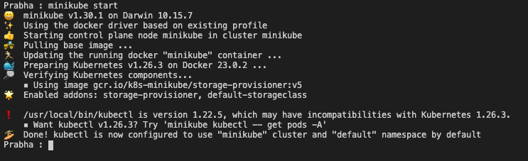
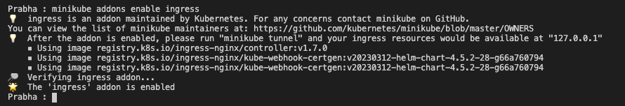
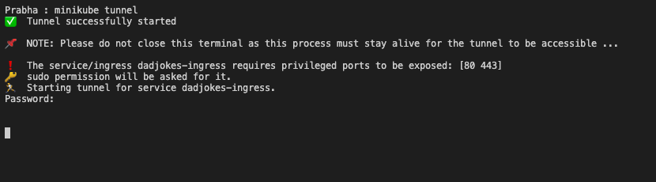
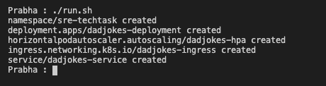
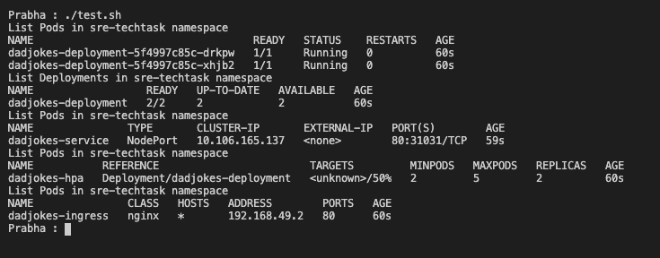
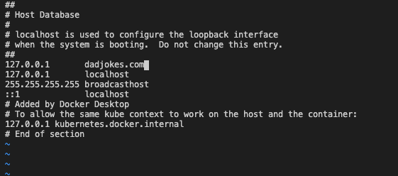
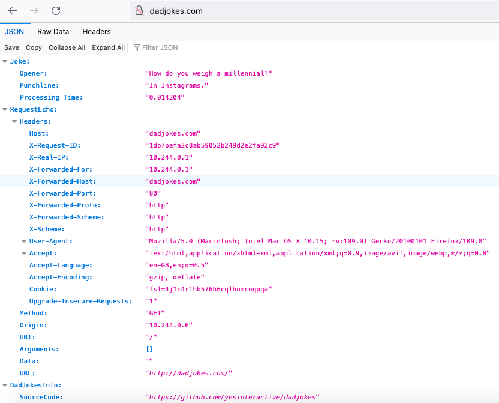
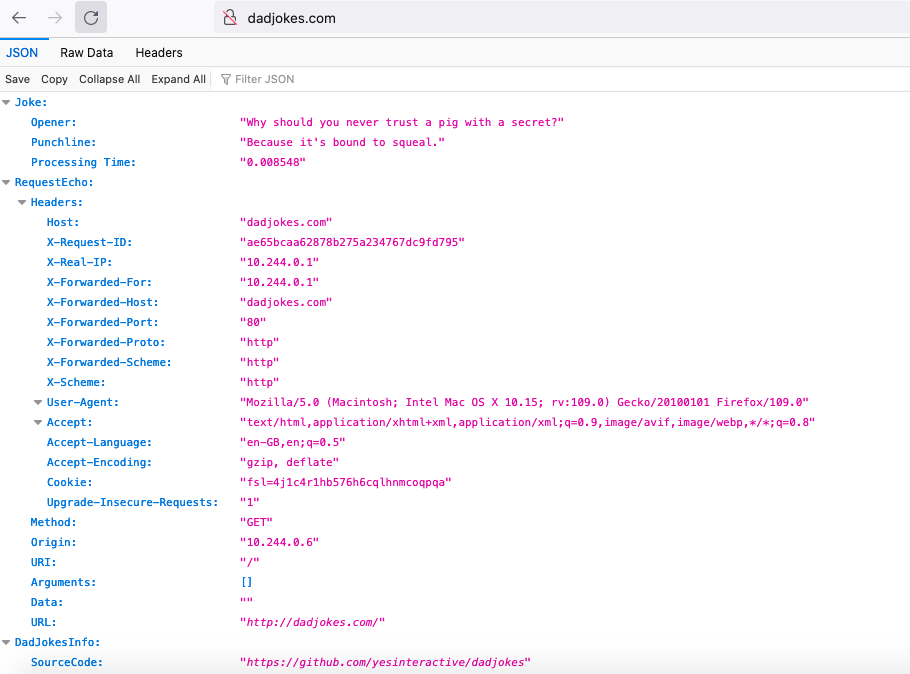
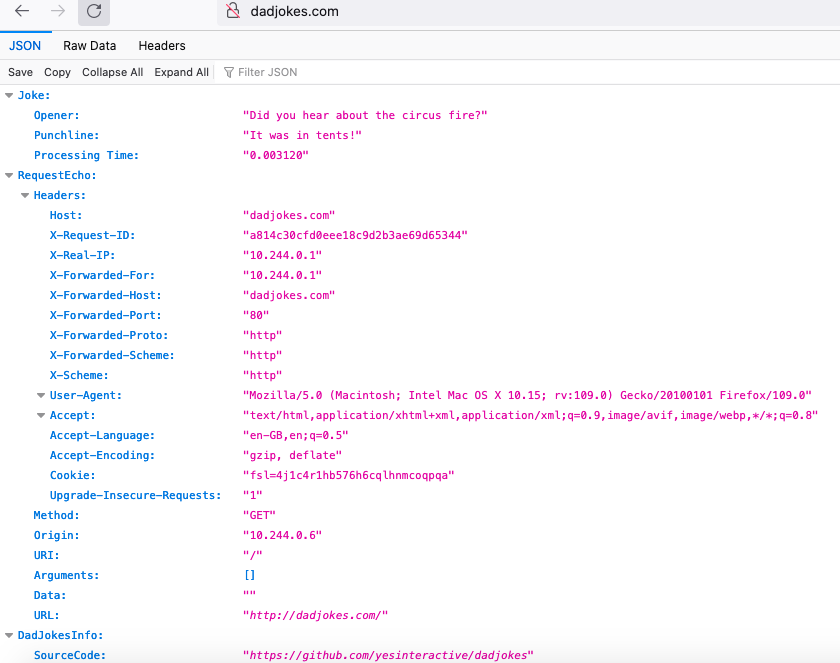

# Task
This test is primarily designed to give you an opportunity to demonstrate your technical skills.

## The task:
- The aim of the task is to get the `yesinteractive/dadjokes` container running in [Minikube](https://minikube.sigs.k8s.io/docs/), with the `ingress` addon enabled, `minikube addons enable ingress`.
- The solution to this task should not require any external resources outside of Minikube (and optionally Helm).

## The aims:
- All resources should be created in a `sre-techtask` namespace.
- Write the Kubernetes specs to create a minimum of a namespace, deployment, service, and ingress. Along with anything else you feel should be included/required in ensure HA.
- Provide documentation or a script that will deploy your resources to Minikube and confirm successful deployment.

## The verifications: 
- Application can be deployed by invoking a single command.
- All pods are running and stable.
- Application is accessible from the host machine via URL.

## Optional: 
- Use [Helm](https://helm.sh/docs/) to define and deploy the application to Minikube.
- Define a Makefile with targets for deploying the application.
- A customisable target namespace for all application resources.

# Solution

## Pre-requisites:
Step | Description| Info
--- | --- | --- |
1 | Install Minikube | https://minikube.sigs.k8s.io/docs/start/) |
2 | Start Minikube | Run this command to start minikube -  `minikube start` |
3 | Enable Ingress | Run this command to Enable Ingress -  `minikube addons enable ingress` |

## Implementation:
1. Execute run.sh  `./run.sh`
2. This is a Shell script, which first creates a namespace called sre-techtask
3. Then it will run all config files i.e. ingress.yaml, service.yaml and deployment.yaml - which will creates deployments, services and ingress of all service
4. Run `minikube tunnel`, which exposes services to access it from host ip.

## Test:
Step | Description| Info
--- | --- | --- |
1 | List Pods | Run this command to list pods -  `kubectl get pods -n sre-techtask` |
2 | List Deployments | Run this command to list deployments -  `kubectl get deploy -n sre-techtask` |
3 | List Services | Run this command to list services -  `kubectl get svc -n sre-techtask` |
4 | List Ingress | Run this command to list ingress -  `kubectl get ing -n sre-techtask` |

## Notes:
- Change shell script files permission, as needed to you execute. For ex: 
`chmod 755 run.sh test.sh cleanup.sh`

## Screenshots:

### Start MiniKube:

### Add Ingress to MiniKube:

### Running Minikube Tunnel:

### Run Script to create Namespace and Apply K8S Config:

### Run TEST Script to see all the workloads are created:

### Adding DNS entry:

### Opening Application : dadjokes.com

# Improvements
1. Could have used Helm, to more generalise to sending values through values.yaml, so as to maintain deployments through Helm Charts and can maintain envrionments easily
2. Can implement the same with any pipelining tool, so to automate.
3. Maintain readiness, liveness to keep checking applicaiton health
